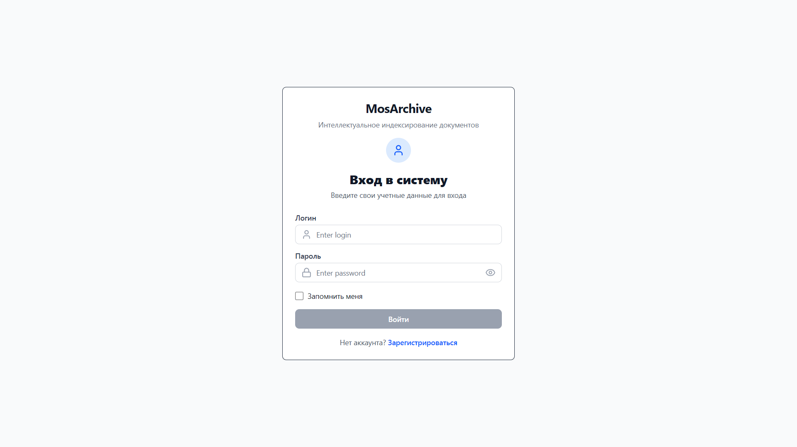
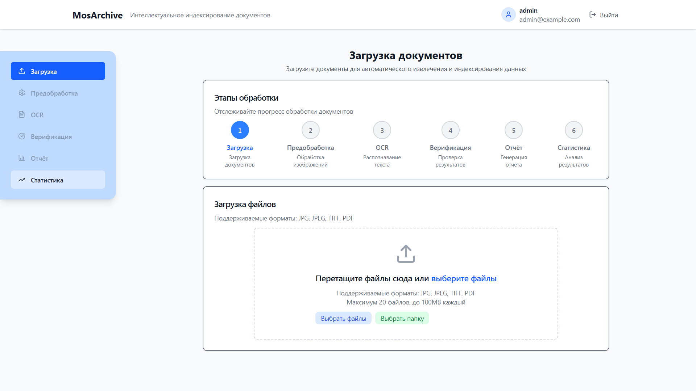
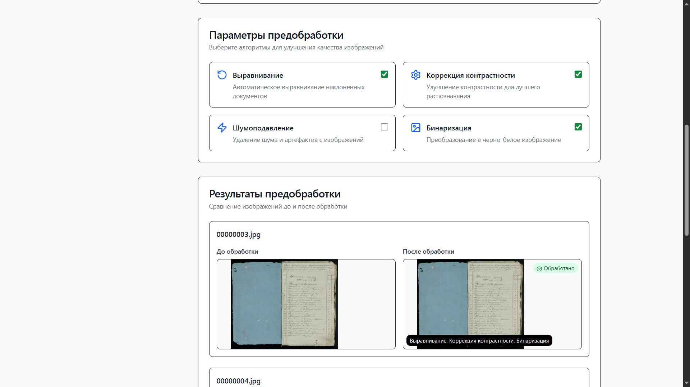
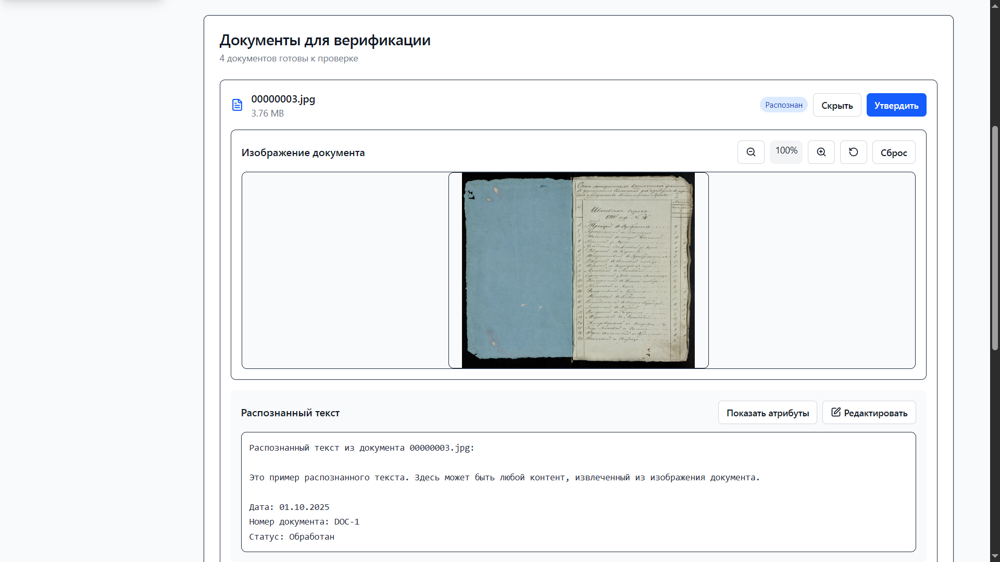
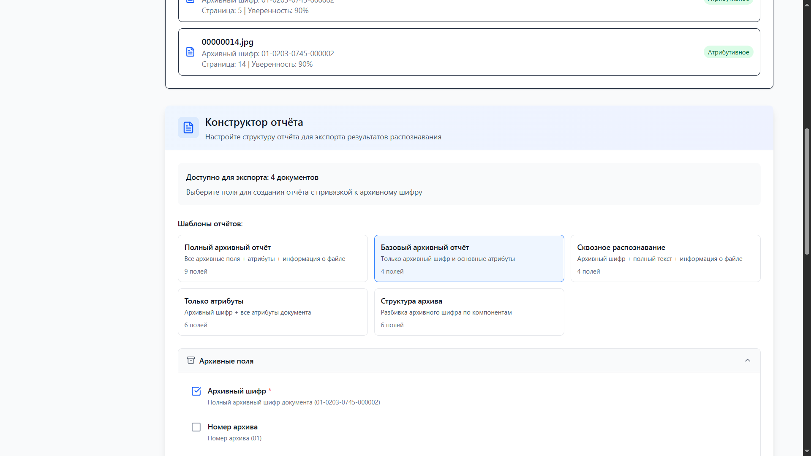
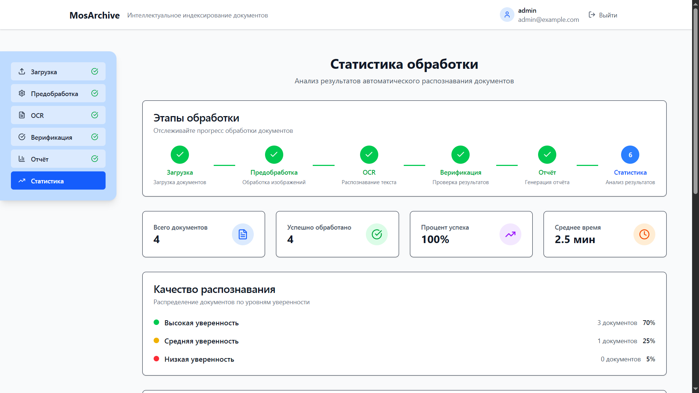

# MosArchive Intelligent Indexing

### Веб-сервис с применением средств искусственного интеллекта для автоматизированного извлечения данных из образов архивных документов, их индексирования и наполнения базы данных.

> Наше решение уже доступно по адресу: http://85.159.231.195

 Вы можете подключиться и ознакомиться с функционалом приложения, используя следующую тестовую учётную запись:
```
L: user
P: user123
```
 > Обратите внимание, что **настройка сертификата для HTTPS пока не завершена**, поэтому браузер может выдавать предупреждения при подключении. Это **нормально**, и Вы можете **безопасно** продолжать использовать приложение.

<div align="center">
  
  
</div>
<div align="center">
  
  
</div>
<div align="center">
  
  
</div>

### Краткое описание

- Веб-сервис с применением средств искусственного интеллекта для автоматизированного извлечения данных из образов архивных документов, их индексирования и наполнения базы данных.

 - Возможность ручной загрузки документов, запуска алгоритмов предобработки изображений и алгоритмов распознавания текста.

  - Наличие этапа верификации для оценки правильности распознования текста с функцией ручной правки и возможностью цветного отображения распознонных атрибутов прямо в тексте.

 - Конструктор отчёта предоставляет гибкую систему для экспорта данных обработанных документов:

    -  **Выбор полей** из 13+ доступных вариантов
    - **Готовые шаблоны** для быстрого создания отчётов
    - **Предварительный просмотр** структуры данных
    - **Экспорт в CSV** с корректной кодировкой для Excel
    - **Статистика** по экспортируемым данным
    - **Расширяемость** новыми полями и шаблонами

## Особенности разработки

**Кроссплатформенное решение** - поддерживается сборка на Windows и Linux.

**Документация** - Код проекта содержит подробные комментарии для быстрого погружения в суть реализации. Детально проработана документация каждого отдельного модуля с инструкциями по интеграции новых технологий.

## Технологии

- **Frontend**: React 19 + TypeScript
- **Backend**: Python + FastAPI
- **Сборщик**: Vite
- **Стили**: Tailwind CSS
- **Иконки**: Lucide React
- **Пакетный менеджер**: Bun

В соответствии с требованиями информационной безопасности, система разработана для работы **в закрытом контуре без доступа к интернету**.

## Быстрый старт

Подробные инструкции по установке и запуску см. в [INSTALLATION.md](documentation/INSTALLATION.md)

1. **Установка зависимостей:**
```bash
# Frontend
bun install

# Backend
pip install -r requirements.txt
```

2. **Запуск:**
```bash
# Backend (терминал 1)
python start_backend_full.py

# Frontend (терминал 2)
bunx vite
```

3. Откройте `http://localhost:5173`

## Документация

```
documentation/
├── INSTALLATION.md          # Подробные инструкции по установке
├── ARCHITECTURE.md          # Архитектура системы
├── COMPONENTS.md            # Компоненты
├── DEVELOPMENT.md           # Разработка
├── DOCKER.md                # Docker-инфраструктура
├── UI_ARCHITECTURE.md       # UI-архитектура
├── frontend/                # Frontend модули
└── backend/                 # Backend модули
```

### Основные разделы
- [Установка и запуск](documentation/INSTALLATION.md)
- [Архитектура системы](documentation/ARCHITECTURE.md)
- [Компоненты](documentation/COMPONENTS.md)
- [Разработка](documentation/DEVELOPMENT.md)
- [Docker-инфраструктура](documentation/DOCKER.md)
- [UI-архитектура](documentation/UI_ARCHITECTURE.md)

### Frontend модули
- [Обработка изображений](documentation/frontend/README_image_processing.md)
- [Атрибутивное распознавание](documentation/frontend/README_attribute_recognition.md)
- [Верификация результатов](documentation/frontend/README_verification_module.md)
- [Компонент статистики](documentation/frontend/README_statistics_component.md)
- [Система авторизации](documentation/frontend/README_auth.md)
- [Конструктор отчетов](documentation/frontend/README_report_constructor.md)

### Backend модули
- [Backend API](documentation/backend/README.md)
- [Модуль заглушек](documentation/backend/README_placeholders.md)